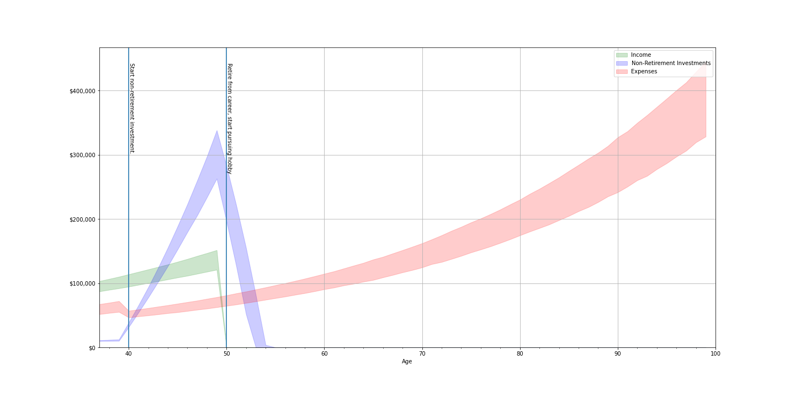

# Table of Contents
1. [Steps to get tool up and running](RUNNING.md)
2. [Overview](#overview)
3. [Usage Notes](#usage-notes)
4. [Distribution Rules](#distribution-rules)
5. [Adding Items](#adding-items)
6. [Running your simulations](#running-your-simulations)
7. [Customizing the graphs](#customizing-the-graphs)
8. [Output](#output)


# Overview

I built this tool to be a rough and simple way to simulate my future finances.  It allows you to enter **income**, **expenses**, and **investments** (non-retirement and retirement).  It then graphs out how those accounts track over time.  This is an easy way to visualize if you will have enough in retirement, if you can cover unexpected medical expenses, etc.  

This tool also lets you easily play around with different scenarios.  What if my investments do really well?  What if I'm more conservative and only want to project 3% growth?  What if I increased my contributions.  What if I had an emergency medical expense at age 60 that costs between `$10k` and `$75k`?

Rather than using exact values, every value in this tool is treated as a range.  For example, instead of saying your investments will grow at 3%, you can enter it as a range and of -3% to 6%.  The tool runs a number of simulations (by default, 10,000) testing possible values inside that range.  Each range is treated as a normal distribution (i.e. bell curve) where the `low` and `high` values represent a 90% confidence interval.  The above example is the equivalent of saying<br>

*"I don't know how much my investment will grow, but I'm 90% certain it won't be less than -3% nor will it be greater than 6%"*

Because this tool is using ranges the graphs won't have a single line representing things like networth or account balances.  Rather the graphs show the entire 90% confidence range.

Everything in the tool is indexed by your age.  To me it seemed more useful to show that I am retiring at age 60 rather than trying to figure out which calendar year that is.

Make your changes in `finances.ipynb`.  All the processing happens in `financeTool.py`, but there should be no need for users to need to mess with this file.

# Usage Notes
* Start age is always inclusive.  *i.e. 30 means starting at age 30*
* End age is always exclusive.  *i.e. 60 means up to but excluding age 60*
* All values are treated as a range over a normal distribution.  low and high represent 90% confidence.
* If you are certain of a value and don't want to treat it as a range, set `low` and `high` to the same value.

# Distribution Rules

The distribution modeling in this tool is fairly simplisitic.  A more sophisticated tool would have multiple distribution strategies, try them all, and suggest the best one for your situation.  This is not such a sophisiticated tool :) The following rules are used for distribution:

* Distributions are only needed to cover **expenses**.

* Distributions come out of investments in the order those investments were added.

> Suppose you added two non-retirement investment accounts in order, A then B.  Account A will be fully drained before it starts making distributions from account B.

* Distributions are only needed when **expense** exceeds **income**, and then, only for the **income shortfall**.
* Distributions come out of non-retirement accounts first, then retirement (if retirement eligible that year).
* Retirement accounts are eligible for distributions at age 60.

# Adding items

There are four functions used to add items.  The parameters for all of these functions are the same.  You can add as many items as you want, they just all need a different name.  

* add_income(...)
* add_expense(...)
* add_nonretirement_investment(...)
* add_retirement_investment(...)

| parameter | Required? | Default | Choices | Description |
|--------------|-----------|------------|------------|------------|
| `name` | yes |  | string| The name of the item you are adding. |
| `starting_amt_low` | yes |  | int | The lower bound of the range. |
| `starting_amt_high` | yes |  | int | The upper bound of the range. |
| `start_age` | yes |  | int | The age in which this item begins. |
| `end_age` | no | `start_age` + 1  | int | The age when this item ends. |
| `growth_perc_low` | no | 0  | float | The lower bound of the rate at which this item grows.<br>e.g. -4% is expressed as -0.04  |
| `growth_perc_high` | no | 0  | float | The upper bound of the rate at which this item grows.<br>e.g. 6% is expressed as 0.06  |
| `annual_contrib_amt_low` | no | 0  | int | The lower bound of the range of annual contribution amount.<br>Applies to investments only.  |
| `annual_contrib_amt_high` | no | 0  | int | The upper bound of the range of annual contribution amount.<br>Applies to investments only.  |
| `annual_contrib_start_age` | no | 0  | int | The age when these annual contributions start.<br>Applies to investments only. |
| `annual_contrib_end_age` | no | 0  | int | The age when these annual contributions end.<br>Applies to investments only. |


### examples

#### Income

Adding your current income.  You're currently making `$75k`.  Your annual bonus is somewhere between `$10k` and `$25k`.  Your annual raises are between `1%` and `5%`.  You plan on leaving this job by age 50.

```
tool.add_income(
    name = "job salary",
    starting_amt_low = 75000 + 10000,
    starting_amt_high = 75000 + 25000,
    start_age = current_age,
    end_age = 50,
    growth_perc_low = .01,
    growth_perc_high = .05
)
```


#### Expenses

You are currently spending `$50k` to `$65k` per year.  That grows between `2%` to `5%` each year.  The kids will be out of the house in 3 years, so you expect to be spending less at that point.

```
tool.add_expense(
    name = "Expenses with kids",
    starting_amt_low = 50000,
    starting_amt_high = 65000,
    start_age = current_age,
    end_age = current_age + 3,
    growth_perc_low = .02,
    growth_perc_high = .05
)

tool.add_expense(
    name = "Expenses without kids",
    starting_amt_low = 45000,
    starting_amt_high = 55000,
    start_age = current_age + 3,
    end_age = death_age,
    growth_perc_low = .02,
    growth_perc_high = .05
)
```


#### Investments

You just started a mutual fund with `$10k` and plan on contributing between `$20,000` and `$25,000` annually in a few years until you retire at age 50.  You expect rates to be anywhere between `-2%` and `10%`.

You also have a 401k that currently has a balance of `$205k`.  It's expected to grow between `-2%` and `15%`.  You are contributing `8%` of your `$75k` paycheck every year until you retire at age 50.

```
tool.add_nonretirement_investment(
    name = "brokerage account",
    starting_amt_low = 10000,
    starting_amt_high = 10000,
    start_age = current_age,
    end_age = death_age,
    growth_perc_low = -.02,
    growth_perc_high = .1,
    annual_contrib_amt_low = 20000,
    annual_contrib_amt_high = 25000,
    annual_contrib_start_age = current_age + 3,
    annual_contrib_end_age = 50
)

tool.add_retirement_investment(
    name = "401k",
    starting_amt_low = 205000,
    starting_amt_high = 205000,
    start_age = current_age,
    end_age = death_age,
    growth_perc_low = -0.02,
    growth_perc_high = 0.15,
    annual_contrib_amt_low = 75000 * .08,
    annual_contrib_amt_high = 75000 * .08,
    annual_contrib_start_age = current_age,
    annual_contrib_end_age = 50
)
```


# Running your simulations
The easiest way to execute the program is to `Restart Kernel and Run All Cells...` from the `Run` menu.

If you are familiar with Jupyter you know that you can run one cell with `shift` + `enter`.  In this notebook that is only safe to do on the cells for drawing the graph.  In the cells where you are adding account info if you try to run a cell after its already been run you will get errors like<br>
`cannot insert <account name> balance low, already exists`


# Customizing the graphs

## Accounts Graph
The `show_account_types_graph()` function can be called with no parameters at all.  However, the following parameters are available:

| parameter | Default | Choices | Description |
|--------------|-----------|------------|------------|
| `start_age` | `current age`| integer| The left bound of the graph.|
| `end_age` | `death_age age`| integer| The right bound of the graph.|
| `yMax` | `None` | integer| The upper bound of the graph.<br>If not set the graph will automatically set the upper bound to fit all the data|
| `lines` | `[]` | array of tuples `(age<int>, text<str>)`| Lines you want to draw on the graph, with text.<br>See example below.|
| `showRetirementLine` | `True`| `True` or `False`| Wheter to show a line when retirement investments become available.|
| `showIncome` | `True`| `True` or `False`| Whether to show income.|
| `showExpenses` | `True`| `True` or `False`| Whether to show expenses.|
| `showNonRetirement` | `True`| `True` or `False`| Whether to show non-retirement investments.|
| `showRetirement` | `True`| `True` or `False`| Whether to show retirement investments.|


### example
```
my_text = [
            (40, "Start non-retirement investment."),
            (50, "Retire from career, start pursuing hobby")
          ]

tool.show_account_types_graph(
    showIncome=True,
    showExpenses=True,
    showRetirement=False,
    showNonRetirement=True,
    showRetirementLine=False,
    lines=my_text
)
```



## Networth Graph

The networth graph is the most simple view of your financial future.  It shows amount remaining after expenses each year.  Note that retirement investments are only shown as networth after the retirement age of 60.  Like all other values networth is represented as a range.  If any part of the range dips below $0, the whole range is shown as red.

The `show_networth_graph()` function can be called with no parameters at all.  However, the following parameters are available:

| parameter | Default | Choices | Description |
|--------------|-----------|------------|------------|
| `start_age` | `current age`| integer| The left bound of the graph.|
| `end_age` | `death_age age`| integer| The right bound of the graph.|
| `yMax` | `None` | integer| The upper bound of the graph.<br>If not set the graph will automatically set the upper bound to fit all the data|
| `yMin` | `None` | integer| The lower bound of the graph.<br>If not set the graph will automatically set the upper bound to fit all the data|
| `lines` | `[]` | array of tuples `(age<int>, text<str>)`| Lines you want to draw on the graph, with text.<br>See example below.|
| `showRetirementLine` | `True`| `True` or `False`| Wheter to show a line when retirement investments become available.|


### example
```
my_text = [
            (40, "Start non-retirement investment."),
            (50, "Retire from career, start pursuing hobby")
          ]
tool.show_networth_graph(lines=my_text)
```


# Output
The graphs and CSVs of the dataframes running behind this tool are output to the `jupyter/data` directory.
